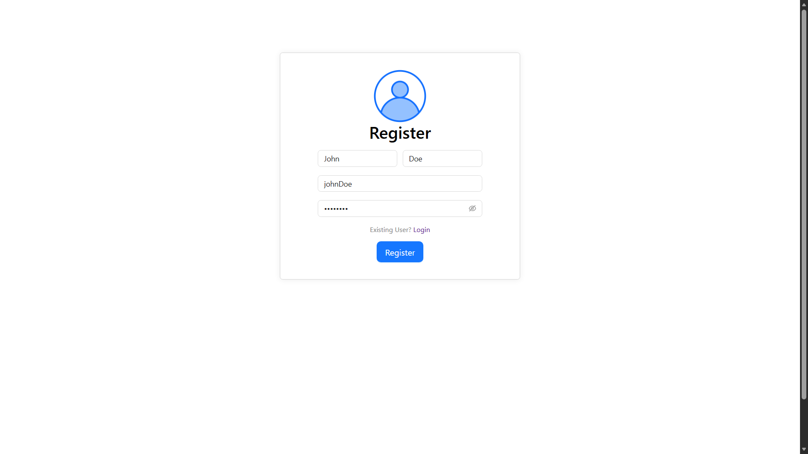
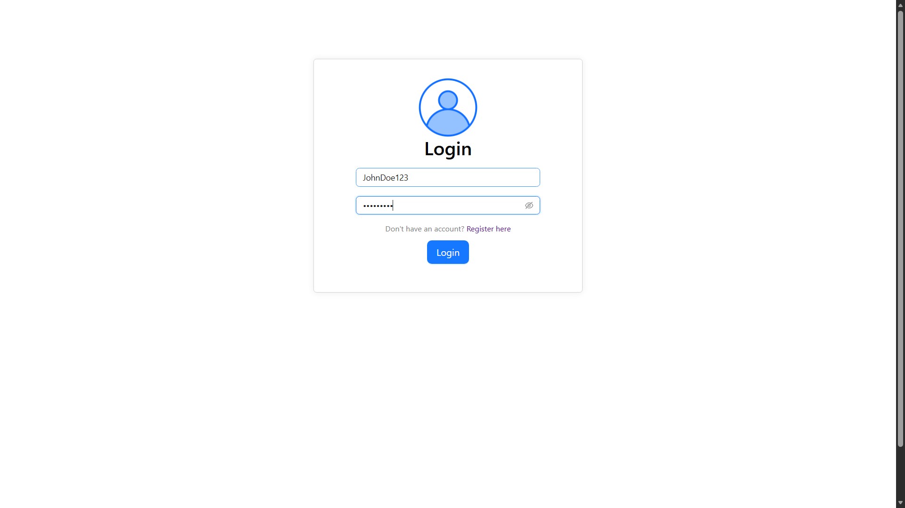

# TaskFlow MERN

A full-stack task management application built using the MERN stack.

---

## Live Demo

Application Link:

https://taskflow-mern-kappa.vercel.app/

> Note: Authentication APIs currently require local backend setup. Frontend UI and task management interface can still be explored through the live demo.

---

## Tech Stack

### Frontend
- React
- Vite
- CSS

### Backend
- Node.js
- Express.js

### Database
- MongoDB
- Mongoose

### Authentication
- JWT Authentication
- bcryptjs

---

## Features

- User Authentication
- Secure Login & Signup
- Create Tasks
- Update Tasks
- Delete Tasks
- Mark Tasks as Completed
- Light/Dark Theme
- Responsive Design
- MongoDB Data Persistence

---

## Screenshots

<p align="center">
  
   
  
</p>

---

## Project Structure

```bash
taskflow-mern/
│
├── client/     # React frontend
│
├── server/     # Express backend
│
├── .gitignore
│
└── README.md
```